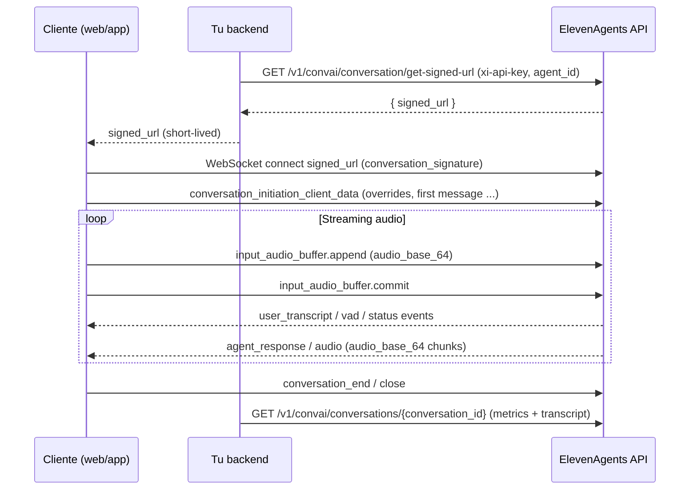

# Acceso vía API a un agente de ElevenLabs creado en elevenlabs.io

## Resumen ejecutivo

Sí: los agentes creados en la interfaz web se exponen como recursos en la **API de ElevenAgents** (prefijo `/v1/convai/...`). Puedes **listarlos**, **obtener su configuración** (prompt/s, LLM, TTS/voz, herramientas, knowledge base, guardrails, privacidad, etc.), **actualizarlos** y **eliminarlos** mediante endpoints REST, y **ejecutar conversaciones en tiempo real** mediante **WebSockets** (con streaming de audio y eventos). citeturn3view1turn10view1turn2view0turn1view7

En cuanto a “qué datos puedes obtener”, hay tres bloques principales:

1) **Metadatos y configuración del agente** (REST “Agents”). La configuración puede ser versionada (branches/versions/drafts) y puede recuperarse por `version_id`/`branch_id`/`include_draft`. citeturn10view1turn27search6  
2) **Datos de conversaciones** (REST “Conversations”): lista, detalles, transcript con tool calls/results, métricas por conversación (duración, rating, éxito), búsqueda textual/semántica, y **descarga del audio de la conversación** si existe. citeturn12view0turn24search10turn15search9turn15search3turn12view1  
3) **Ejecución/streaming** (WebSocket): flujo de eventos para iniciar sesión, enviar audio (o modo “chat”/texto), recibir respuestas y audio en chunks, y opcionalmente monitorización en vivo (si está habilitada). citeturn2view0turn1view7turn15search13turn15search14

Limitaciones clave: algunos detalles están **no documentados** (por ejemplo, el *Content-Type* exacto del endpoint de descarga de audio de conversación; también ciertos campos completos de “Get agent/Update agent” no son accesibles desde la documentación web en esta sesión), y ciertas funciones son **plan‑limitadas** (p.ej. formatos de audio 44.1kHz WAV/PCM, “zero retention”, y límites de concurrencia). citeturn23view0turn15search14turn10view2

## Alcance y cómo se mapea “agente web” a “recurso API”

Cuando creas un agente en la web, conceptualmente queda registrado como un recurso `agent_id` accesible por la API “Agents”. El endpoint de **listado** (`GET /v1/convai/agents`) devuelve una lista de agentes con metadatos como:

- `agent_id`, `name`, `tags`
- `created_at_unix_secs`
- `last_call_time_unix_secs`
- `archived`
- `access_info` (rol/propietario en workspace) citeturn3view1turn24search12

La plataforma soporta **versionado** del agente: branches, versions, traffic deployments y drafts. Esto afecta *qué* configuración obtienes cuando “lees” el agente (por defecto: branch Main, tip actual; opcionalmente: `version_id`, `branch_id`, `include_draft`). La documentación describe explícitamente que una *version* es un snapshot inmutable que contiene `conversation_config`, `platform_settings` (subset versionado) y `workflow`, y que hay settings per‑agent compartidos (p.ej. `auth`, `privacy`, `call_limits`). citeturn10view1

En la práctica, para contestar “qué puedo obtener”:

- **Metadatos**: por `GET /v1/convai/agents` y endpoints auxiliares (`/summaries`, `/link`). citeturn3view1turn4view5turn4view9  
- **Configuración completa**: por `GET /v1/convai/agents/{agent_id}` (con parámetros de versionado). Aunque el esquema completo no está disponible aquí (limitación de documentación accesible), está soportado por SDKs y por la explicación del sistema de versionado. citeturn10view1turn18search4  
- **Historial/conversaciones**: por `/v1/convai/conversations...` (incluye transcript, tool calls/results, métricas, audio). citeturn12view0turn24search10turn12view1

## Autenticación y modelo de permisos

### Autenticación a la API (server-to-server)

La API HTTP usa **API keys** enviadas en el header `xi-api-key`. Las claves pueden configurarse con:

- **Scope restriction**: limitar a qué endpoints puede acceder la key.
- **Credit quota**: límites de consumo por key. citeturn10view0

Ejemplo mínimo (REST):

```bash
curl 'https://api.elevenlabs.io/v1/models' \
  -H 'Content-Type: application/json' \
  -H 'xi-api-key: '"$ELEVENLABS_API_KEY"
```

citeturn10view0

Sobre **scopes/permissions** con nombres concretos (p.ej. “Text to Speech”, “ElevenLabs Agents Write”, etc.), existe documentación de producto que indica que puedes asignar permisos por categoría de endpoint; en este informe, los nombres exactos de todos los scopes no están completamente enumerados por limitación de fuentes accesibles en texto completo, pero sí se confirma la existencia de permisos específicos para ElevenAgents y TTS. citeturn0search21turn15search13turn23view0

### Autenticación para clientes (frontend) al conversar con un agente

La recomendación explícita es **no exponer la API key en el cliente**. Para conversaciones WebSocket desde navegador/app:

- Usa **Signed URLs**: tu servidor pide una URL firmada y el cliente se conecta con esa URL; expira a los **15 minutos** para iniciar la conversación. citeturn16search7turn12view2  
- Usa **Allowlists**: restringe por dominio/origen (hasta 10 hostnames). citeturn16search7

El endpoint REST para firmar (server-side) es:

- `GET /v1/convai/conversation/get-signed-url` con `agent_id` y opcionalmente `include_conversation_id`, `branch_id`, `environment`. citeturn12view2

**Agentes públicos vs privados**: la guía de librería JavaScript indica que agentes “public” pueden iniciar sesión solo con `agentId` (sin firma), mientras que para agentes con autorización se usa firmado. citeturn6search14turn16search7

### Modelo de permisos (workspace/roles + API key)

Hay al menos dos capas:

1) **Permisos de la API key** (scopes + cuota), aplicados globalmente a endpoints. citeturn10view0  
2) **Permisos/roles en el workspace** sobre recursos compartidos. El listado de agentes incluye `access_info.role` y datos del creador, lo que sugiere RBAC por rol (p.ej. `admin`). citeturn3view1  

Ejemplo adicional de permisos: la guía de **real-time monitoring** exige:
- API key con scope “ElevenLabs Agents Write”
- Acceso al workspace con rol `EDITOR`
- Header `xi-api-key`. citeturn15search13

## API REST de agentes y campos que se devuelven

### Tabla comparativa de endpoints y campos devueltos

> Nota importante sobre “exactamente”: la documentación web de `Create agent / Get agent / Update agent` no es accesible íntegramente aquí; por tanto, el listado de campos **completos** de esos endpoints se marca como **no documentado** cuando no puede verificarse. Aun así, se triangula desde: versionado (qué contiene una version), changelogs (campos añadidos), SDKs oficiales y ejemplos en repositorios. citeturn10view1turn27search12turn24search3turn18search4turn21view3

| Recurso | Método | Endpoint (base `https://api.elevenlabs.io`) | Campos principales en respuesta | Observaciones |
|---|---:|---|---|---|
| Listar agentes | GET | `/v1/convai/agents` | `agents[]`: `agent_id`, `name`, `tags`, `created_at_unix_secs`, `access_info{role,...}`, `last_call_time_unix_secs`, `archived`; paginación `has_more`, `next_cursor` | Filtros: `page_size`, `search`, `archived`, `created_by_user_id` (`@me`), `sort_by` (`name`, `created_at`, `call_count_7d`), `cursor`. citeturn3view1turn24search12 |
| Crear agente | POST | `/v1/convai/agents/create` | `agent_id` | Body incluye `conversation_config` requerido y opcionalmente `platform_settings`, `name`, `tags` (según SDK/clients). Campos completos: **no documentado** (en esta sesión). citeturn11search1turn18search4turn21view3 |
| Obtener agente | GET | `/v1/convai/agents/{agent_id}` | Config + metadatos (incluye `conversation_config`, `platform_settings`, `workflow`, info de versionado) | Parámetros de versionado (`version_id`, `branch_id`, `include_draft`) soportados por SDK/guía de versioning; campos exactos: **no documentado** aquí. citeturn10view1turn27search6turn18search4 |
| Actualizar agente | PATCH | `/v1/convai/agents/{agent_id}` | (posible vacío o config actualizada) | Soporta actualizaciones por branch (`branch_id`) y habilitación de versioning si no está (`enable_versioning_if_not_enabled`). Campos exactos y respuesta: **no documentado** aquí. citeturn10view1turn27search6turn27search14turn21view1 |
| Eliminar agente | DELETE | `/v1/convai/agents/{agent_id}` | vacío `{}` | Endpoint documentado y accesible. citeturn1view3 |
| Link compartible (token) | GET | `/v1/convai/agents/{agent_id}/link` | `agent_id`, `token{conversation_token, expiration_time_secs, conversation_id,...}` | Útil para compartir/iniciar conversaciones con token. citeturn4view5 |
| Resúmenes de agentes | GET | `/v1/convai/agents/summaries` | `agents[]` con resúmenes | Útil para “overview” rápido. citeturn4view9 |
| Estimar uso/costo LLM | POST | `/v1/convai/agent/{agent_id}/llm-usage/calculate` | `llm_panels[]` con `expected_total_tokens`, `cost_estimate` (etc.) | Específico para dimensionar costos del agente. citeturn4view7 |

### Campos/atributos del agente: qué es recuperable vs no accesible

Basado en: (a) contenido de una *version* (qué “compone” un agente), (b) evidencia de campos añadidos en changelog, y (c) ejemplos/SDKs. citeturn10view1turn27search12turn24search3turn21view0

| Categoría solicitada | ¿Recuperable vía API? | Evidencia / endpoint | Notas |
|---|---|---|---|
| Metadata (id, nombre, tags, creado, archived, last call) | Sí | `GET /v1/convai/agents` citeturn3view1turn24search12 | “call_count_7d” está en `sort_by`; si el campo exacto se devuelve en cada item: **no documentado** aquí. citeturn24search12 |
| Voice model / voice_id / config TTS | Parcialmente sí | En `conversation_config` y changelog de TTS para agentes | Se documenta que `conversation_config` incluye voice config y que hubo cambios en modelos TTS (`eleven_v3_conversational`) y campos como `suggested_audio_tags`. El nombre exacto del campo dentro del JSON del agente: **no documentado** aquí. citeturn10view1turn24search3turn21view0 |
| Prompts / instrucciones / persona | Sí | `conversation_config.agent.prompt` (SDK/ejemplos); snapshots de versions | Prompt y parámetros (p.ej. temperature) aparecen en ejemplos. citeturn10view1turn21view0turn21view3 |
| “Custom instructions” (equivalente a prompt y reglas) | Sí | mismo que arriba | Se modela como prompt y settings del agent. citeturn10view1turn21view0 |
| Parámetros de modelo (LLM provider, temperature, cascades, timeouts) | Sí, pero no “pesos” | En `conversation_config` + changelogs | Ej.: `cascade_timeout_seconds` fue añadido a backup LLM config; otros campos de guardrails/privacidad se añadieron. Pesos/arquitectura interna: **no accesible** (no expuesto). citeturn27search17turn27search12turn10view1 |
| Conversation history (transcript) | Sí | `GET /v1/convai/conversations/{conversation_id}` citeturn24search10 | Incluye tool calls/results; más abajo se detalla el schema observable. |
| State (estado de conversación) | Sí | `status` en conversaciones, y live count | Estados listados como `initiated`, `in-progress`, `processing`, `done`, `failed`. citeturn14search3turn12view0turn24search0 |
| Usage metrics (por conversación + live) | Sí (parcial) | list/get conversations + analytics live count | Duración, rating, message_count, call_successful, etc. Métricas agregadas avanzadas por agente: **no documentado** (más allá de `call_count_7d` y dashboards). citeturn12view0turn24search0turn24search12 |
| Logs (tool usage, errores de tools) | Sí (a nivel transcript/monitoring) | transcript tool_calls/tool_results + monitoring + search endpoints | Para “logs internos de infraestructura”: **no documentado/no expuesto**. citeturn24search10turn15search13turn15search9 |
| Audio files (outputs) | Sí, en dos vías | (1) TTS endpoints (2) audio de conversación | Audio de conversación descargable: endpoint existe; formato exacto: **no documentado**. TTS sí documenta formatos. citeturn12view1turn23view0 |
| “Conversation memory/state” persistente del agente | Parcial / depende de features | No hay un recurso “state store” explícito | Lo persistente se refleja en config (knowledge base, tools, etc.) y en transcripts. Estado interno de turn-taking/ASR buffers: **no documentado**. citeturn10view1turn2view0 |
| Secrets (tokens/passwords para tools) | **No debería** ser legible en claro | Existen endpoints para secrets en el ecosistema | Por seguridad: normalmente solo se crea/rota/borra, no se lee el valor. Como la documentación completa no está disponible aquí: **no documentado**. citeturn11search0turn11search2turn10view1 |

### Esquemas JSON de muestra (tabla)

A continuación van **fragmentos** de JSON Schema para orientar integraciones. Donde un campo es incierto por falta de documentación accesible, se marca como `no documentado`.

| Esquema | JSON Schema (fragmento) |
|---|---|
| `AgentListResponse` | `{"type":"object","properties":{"agents":{"type":"array","items":{"$ref":"#/definitions/AgentListItem"}},"has_more":{"type":"boolean"},"next_cursor":{"type":"string"}},"required":["agents","has_more"]}` citeturn3view1turn24search12 |
| `AgentListItem` | `{"type":"object","properties":{"agent_id":{"type":"string"},"name":{"type":"string"},"tags":{"type":"array","items":{"type":"string"}},"created_at_unix_secs":{"type":"integer"},"access_info":{"type":"object"},"last_call_time_unix_secs":{"type":"integer"},"archived":{"type":"boolean"}},"required":["agent_id","name"]}` citeturn3view1turn24search12 |
| `ConversationListResponse` | `{"type":"object","properties":{"conversations":{"type":"array","items":{"$ref":"#/definitions/ConversationListItem"}},"has_more":{"type":"boolean"},"next_cursor":{"type":"string"}},"required":["conversations","has_more"]}` citeturn12view0 |
| `ConversationListItem` | `{"type":"object","properties":{"agent_id":{"type":"string"},"conversation_id":{"type":"string"},"start_time_unix_secs":{"type":"integer"},"call_duration_secs":{"type":"integer"},"message_count":{"type":"integer"},"status":{"type":"string"},"call_successful":{"type":"string"},"branch_id":{"type":"string"},"version_id":{"type":"string"},"rating":{"type":"number"}},"required":["agent_id","conversation_id","status"]}` citeturn12view0 |
| `TTSSpeechConvertRequest` | `{"type":"object","properties":{"text":{"type":"string"},"model_id":{"type":"string"},"language_code":{"type":"string"},"voice_settings":{"type":"object"},"seed":{"type":"integer"}},"required":["text"]}` citeturn23view0 |
| `AgentWebSocketAudioEvent` | `{"type":"object","properties":{"type":{"const":"audio"},"audio_event":{"type":"object","properties":{"audio_base_64":{"type":"string"},"event_id":{"type":"integer"},"alignment":{"type":"object","description":"no documentado (detalle completo)"}},"required":["audio_base_64"]}},"required":["type","audio_event"]}` citeturn2view0turn1view7 |

## Conversaciones: historial, métricas, búsqueda y audio

### Listado y filtros

`GET /v1/convai/conversations` devuelve conversaciones de agentes que posees (opcionalmente filtradas por `agent_id`) y provee un set de filtros de analítica, incluyendo:

- Ventana temporal: `call_start_before_unix`, `call_start_after_unix`
- Duración: `call_duration_min_secs`, `call_duration_max_secs`
- Éxito: `call_successful` (`success|failure|unknown`)
- Rating (1–5): `rating_min`, `rating_max`
- Presencia de feedback: `has_feedback_comment`
- “summary mode”: incluir/excluir `transcript_summary` en el listado
- `conversation_initiation_source`
- Tool filters: `tool_names` (y variantes)
- `branch_id` y paginación (`cursor`, `page_size`). citeturn12view0

La respuesta incluye, por conversación, campos como `conversation_id`, `agent_id`, timestamps, duración, `message_count`, `status`, `call_successful`, `branch_id`, `version_id`, `agent_name`, `transcript_summary`, `tool_names`, `rating`, etc. citeturn12view0

### Detalles de una conversación y transcript

`GET /v1/convai/conversations/{conversation_id}` devuelve:

- `agent_id`, `conversation_id`, `status`
- `metadata` (con múltiples propiedades)
- flags de audio: `has_audio`, `has_user_audio`, `has_response_audio`
- `transcript[]` (objetos con `role`, `message`, y estructuras para tool calls/results)
- `analysis` (objeto con múltiples propiedades)
- Identificadores de versionado (`branch_id`, `version_id`) y `user_id`. citeturn14search3turn24search10

Además, el changelog indica evolución reciente del schema de conversación: por ejemplo, se añadió `hiding_reason` y se extendieron entries del transcript para soportar metadata de `file_input` con `ChatSourceMedium` (audio, text, image, file). citeturn27search12

### Búsqueda sobre mensajes (texto y semántica)

Para “logs” y auditoría sobre transcripts a escala, existen endpoints dedicados:

- `GET /v1/convai/conversations/messages/text-search` (full‑text + fuzzy) citeturn15search9  
- `GET /v1/convai/conversations/messages/smart-search` (búsqueda semántica por embeddings; devuelve chunks y score) citeturn15search3  

Esto te permite recuperar “trozos relevantes” (`chunk_text`, `score`, `conversation_id`, etc.) sin descargar todos los transcripts. citeturn15search3

### Audio de conversación

`GET /v1/convai/conversations/{conversation_id}/audio` existe para “Get the audio recording of a particular conversation”. citeturn12view1

- **Formato/codec exacto del archivo de audio**: **no documentado** en el texto accesible (no aparece `Content-Type`, ni `output_format` en ese endpoint). Lo más robusto es tratar la respuesta como binaria y guardar el stream y/o leer `Content-Type` en runtime. citeturn12view1  
- La disponibilidad se puede inferir vía flags `has_audio`/`has_user_audio`/`has_response_audio` del detalle de conversación. citeturn14search3turn24search10  

### Métricas “en vivo”

`GET /v1/convai/analytics/live-count` devuelve `{"count": <int>}` para el número de conversaciones activas, opcionalmente filtrado por `agent_id`. citeturn24search0

### Ejemplos prácticos (cURL + Python requests)

**Listar conversaciones (paginación + filtros):**

```bash
curl -G 'https://api.elevenlabs.io/v1/convai/conversations' \
  -H 'xi-api-key: '"$ELEVENLABS_API_KEY" \
  --data-urlencode 'agent_id='"$AGENT_ID" \
  --data-urlencode 'page_size=30' \
  --data-urlencode 'summary_mode=exclude'
```

citeturn12view0

```python
import os, requests

API_KEY = os.environ["ELEVENLABS_API_KEY"]
agent_id = os.environ.get("AGENT_ID")

r = requests.get(
    "https://api.elevenlabs.io/v1/convai/conversations",
    headers={"xi-api-key": API_KEY},
    params={"agent_id": agent_id, "page_size": 30, "summary_mode": "exclude"},
    timeout=30,
)
r.raise_for_status()
data = r.json()
print("has_more:", data.get("has_more"))
print("first conversation:", (data.get("conversations") or [None])[0])
```

citeturn12view0

**Obtener detalles y transcript de una conversación:**

```bash
curl 'https://api.elevenlabs.io/v1/convai/conversations/'"$CONVERSATION_ID" \
  -H 'xi-api-key: '"$ELEVENLABS_API_KEY"
```

citeturn24search10

```python
import requests, os

API_KEY = os.environ["ELEVENLABS_API_KEY"]
conversation_id = os.environ["CONVERSATION_ID"]

r = requests.get(
    f"https://api.elevenlabs.io/v1/convai/conversations/{conversation_id}",
    headers={"xi-api-key": API_KEY},
    timeout=30,
)
r.raise_for_status()
conv = r.json()

print(conv["status"])
print("has_audio:", conv.get("has_audio"))
print("transcript items:", len(conv.get("transcript", [])))
```

citeturn24search10

**Descargar audio de conversación (binario; formato “no documentado”):**

```bash
curl -L 'https://api.elevenlabs.io/v1/convai/conversations/'"$CONVERSATION_ID"'/audio' \
  -H 'xi-api-key: '"$ELEVENLABS_API_KEY" \
  --output conversation_audio.bin
```

citeturn12view1

```python
import os, requests

API_KEY = os.environ["ELEVENLABS_API_KEY"]
conversation_id = os.environ["CONVERSATION_ID"]

with requests.get(
    f"https://api.elevenlabs.io/v1/convai/conversations/{conversation_id}/audio",
    headers={"xi-api-key": API_KEY},
    stream=True,
    timeout=120,
) as r:
    r.raise_for_status()
    content_type = r.headers.get("Content-Type")  # útil para inferir formato
    print("Content-Type:", content_type)

    out_path = "conversation_audio.bin"  # renombrar luego según Content-Type
    with open(out_path, "wb") as f:
        for chunk in r.iter_content(chunk_size=1024 * 256):
            if chunk:
                f.write(chunk)
```

citeturn12view1

## Invocación del agente y streaming

### Flujo recomendado (signed URL) y diagrama de secuencia

Para conversaciones en tiempo real con audio (o chat), el flujo recomendado es:

1) **Servidor** solicita `signed_url` con API key (para no exponerla).  
2) **Cliente** abre WebSocket a esa URL firmada (`conversation_signature`) dentro de 15 min.  
3) Cliente envía **evento de iniciación** (puede incluir overrides).  
4) Cliente envía audio por `input_audio_buffer.append`/`commit` y recibe eventos de transcripción/estado/respuesta/audio. citeturn16search7turn12view2turn2view0turn1view7



citeturn16search7turn12view2turn2view0turn1view7turn24search10

### Endpoint WebSocket y eventos observables

El endpoint WSS principal está documentado como:

- `wss://api.elevenlabs.io/v1/convai/conversation?agent_id=...` citeturn1view7

El set de eventos incluye (entre otros):

- `conversation_initiation_metadata` (metadatos al iniciar)
- `conversation_initiation_client_data` (payload que envías para iniciar; incluye `conversation_config_override`, `custom_llm_extra_body`, `dynamic_variables`, y soporte de primer mensaje override, etc.)
- `input_audio_buffer.append` (envío de audio base64)
- `input_audio_buffer.commit` (commit de buffer)
- `agent_response`, `agent_response_correction`
- `audio` (con `audio_base_64`)
- eventos de herramientas y “ping/pong”, etc. citeturn2view0turn1view7

Un ejemplo textual del propio doc muestra la estructura de `conversation_initiation_client_data` y la idea de overrides/dynamic variables. citeturn1view7

### Chat mode (texto) y concurrencia

Existe un modo “chat-only” (texto sin audio) que:
- puede activarse configurando el agente como chat mode o usando override `conversation.text_only = True` en la iniciación,
- requiere manejar el evento/callback `agent_response`,
- tiene límites de concurrencia **mucho mayores** (tabla con 25× respecto a voz), y pool separado. citeturn15search14

### Streaming adicional: monitorización en vivo

Para observar una conversación en curso, existe un endpoint de monitoring:

- `wss://api.elevenlabs.io/v1/convai/conversations/{conversation_id}/monitor` citeturn15search13  

Requisitos documentados:
- habilitar “Monitoring” en settings del agente,
- API key con “ElevenLabs Agents Write” scope,
- rol `EDITOR` en el workspace. citeturn15search13

### Ejemplos prácticos

#### Obtener signed URL (cURL + requests)

```bash
curl -G 'https://api.elevenlabs.io/v1/convai/conversation/get-signed-url' \
  -H 'xi-api-key: '"$ELEVENLABS_API_KEY" \
  --data-urlencode 'agent_id='"$AGENT_ID" \
  --data-urlencode 'include_conversation_id=true'
```

citeturn12view2

```python
import os, requests

API_KEY = os.environ["ELEVENLABS_API_KEY"]
agent_id = os.environ["AGENT_ID"]

r = requests.get(
    "https://api.elevenlabs.io/v1/convai/conversation/get-signed-url",
    headers={"xi-api-key": API_KEY},
    params={"agent_id": agent_id, "include_conversation_id": True},
    timeout=30,
)
r.raise_for_status()
signed_url = r.json()["signed_url"]
print(signed_url)
```

citeturn12view2

#### Conectar a WebSocket y enviar audio (Python; `requests` no aplica a WS)

`requests` no soporta WebSocket; para streaming necesitas una librería WS. El *shape* de los mensajes/eventos está documentado (tipos listados arriba). citeturn2view0turn1view7

Ejemplo básico (requiere `pip install websocket-client`), enviando un `conversation_initiation_client_data` **mínimo** y luego audio **base64** (aquí se deja la parte de captura/codec como **no documentado** porque depende del formato requerido en `user_input_audio_format`). citeturn1view7turn2view0

```python
import json, os, base64
from websocket import create_connection

SIGNED_URL = os.environ["ELEVENLABS_SIGNED_URL"]

ws = create_connection(SIGNED_URL)

# 1) init (ejemplo mínimo; overrides opcionales)
init_msg = {
  "type": "conversation_initiation_client_data",
  "conversation_config_override": {
    # Ejemplo: activar chat-only si lo necesitas
    # "conversation": {"text_only": True}
  },
  "dynamic_variables": {
    # opcional
  },
}
ws.send(json.dumps(init_msg))

# 2) enviar un chunk de audio (placeholder)
# audio_bytes = ... # capturado/encodeado según el formato requerido
audio_bytes = b""  # placeholder
append_msg = {
  "type": "input_audio_buffer.append",
  "audio": base64.b64encode(audio_bytes).decode("ascii"),
}
ws.send(json.dumps(append_msg))
ws.send(json.dumps({"type": "input_audio_buffer.commit"}))

# 3) leer eventos
for _ in range(10):
  evt = json.loads(ws.recv())
  print(evt.get("type"), evt.keys())

ws.close()
```

citeturn2view0turn1view7

#### Text-to-Speech clásico (REST) como “invoke” alternativo (texto→audio)

Independientemente del agente, puedes generar audio con TTS:

- `POST /v1/text-to-speech/{voice_id}` (devuelve archivo de audio). citeturn23view0

Ejemplo cURL:

```bash
curl -X POST 'https://api.elevenlabs.io/v1/text-to-speech/'"$VOICE_ID"'?output_format=mp3_44100_128' \
  -H 'xi-api-key: '"$ELEVENLABS_API_KEY" \
  -H 'Content-Type: application/json' \
  -d '{
    "text": "Hola. Esta es una prueba de síntesis.",
    "model_id": "eleven_multilingual_v2"
  }' \
  --output tts.mp3
```

citeturn23view0

Ejemplo Python `requests`:

```python
import os, requests

API_KEY = os.environ["ELEVENLABS_API_KEY"]
voice_id = os.environ["VOICE_ID"]

r = requests.post(
    f"https://api.elevenlabs.io/v1/text-to-speech/{voice_id}",
    headers={"xi-api-key": API_KEY, "Content-Type": "application/json"},
    params={"output_format": "mp3_44100_128"},
    json={"text": "Hola. Esta es una prueba de síntesis.", "model_id": "eleven_multilingual_v2"},
    timeout=120,
)
r.raise_for_status()
with open("tts.mp3", "wb") as f:
    f.write(r.content)
```

citeturn23view0

### Tamaño y formato esperado de audio

**TTS (documentado)**: el formato se controla con `output_format` (ej. `mp3_44100_128` por defecto) y hay restricciones de plan:

- MP3 192 kbps requiere Creator+.
- PCM/WAV 44.1 kHz requiere Pro+. citeturn23view0

Estimaciones rápidas (mono, aproximadas):

- MP3 128 kbps ⇒ `128,000 bits/s ≈ 16 KB/s` ⇒ ~0.96 MB por minuto.
- WAV PCM 44.1 kHz, 16‑bit ⇒ `44,100 samples/s * 2 bytes ≈ 88.2 KB/s` ⇒ ~5.3 MB por minuto (mono).  

**Audio de conversación**: formato/tamaño **no documentado**; depende de cómo se grabe/almacene. Se recomienda inspeccionar `Content-Type` y/o headers al descargar. citeturn12view1turn23view0

## Rate limits, errores y consideraciones de seguridad

### Concurrencia y HTTP 429

El Help Center documenta que 429 puede significar:

- `too_many_concurrent_requests`: excediste el **límite de concurrencia** del plan.
- `system_busy`: tráfico alto; reintentar suele funcionar. citeturn10view2

Además, el modo chat-only tiene concurrencia muy superior (tabla por plan) y pool separado. citeturn15search14

### Errores y códigos

La referencia de “Errors” lista códigos y tipos de error comunes, incluyendo (`validation_error`, `rate_limit_exceeded`, `unauthorized`, etc.) y mapea HTTP status como 400/401/403/404/422/429/500. citeturn1view6

En endpoints de ElevenAgents, el error más recurrente en docs es `422 Unprocessable Entity` (inputs inválidos), por lo que conviene tratar 422 como “schema/validation mismatch” y loguear `detail`. citeturn12view0turn23view0turn24search0

### Privacidad, retención y exposición de datos

Riesgos típicos cuando “obtienes todo lo posible” vía API:

- Los **transcripts** pueden contener: mensajes del usuario, outputs del agente y también datos de herramientas (`tool_calls`, `tool_results`) — potencialmente sensibles si tus tools retornan PII o secretos. citeturn24search10turn12view0  
- La plataforma incorporó mecanismos para mitigar fugas, como:
  - `sanitize` en asignaciones de variables dinámicas para remover valores de tool responses/transcripts mientras se procesan para asignación (changelog). citeturn24search3  
  - `conversation_history_redaction` bajo `platform_settings.privacy` con tipos de entidades configurables (changelog). citeturn27search12  

Para TTS, existe `enable_logging=false` para activar “zero retention mode”, pero está indicado como disponible solo para enterprise, y deshabilita features de history (stitching, etc.). citeturn23view0

En seguridad de acceso:
- Nunca expongas `xi-api-key` en cliente; usa signed URLs (expiran 15 min) o allowlists por dominio. citeturn16search7turn12view2  
- Si habilitas monitorización, considera que abre un canal de observación de conversaciones; requiere permisos altos (scope write + editor). citeturn15search13  

## Ejemplos operativos: listar/obtener/actualizar/borrar agente

### Listar agentes

```bash
curl -G 'https://api.elevenlabs.io/v1/convai/agents' \
  -H 'xi-api-key: '"$ELEVENLABS_API_KEY" \
  --data-urlencode 'page_size=30' \
  --data-urlencode 'archived=false' \
  --data-urlencode 'created_by_user_id=@me'
```

citeturn24search12

```python
import os, requests

API_KEY = os.environ["ELEVENLABS_API_KEY"]

r = requests.get(
    "https://api.elevenlabs.io/v1/convai/agents",
    headers={"xi-api-key": API_KEY},
    params={"page_size": 30, "archived": False, "created_by_user_id": "@me"},
    timeout=30,
)
r.raise_for_status()
print(r.json())
```

citeturn24search12

### Obtener detalles/config del agente (schema completo: no documentado)

El endpoint existe (`GET /v1/convai/agents/{agent_id}`) y soporta parámetros de versionado (p.ej. `version_id`, `branch_id`, `include_draft`). La estructura exacta del JSON de respuesta en esta sesión se considera **no documentado**, pero por el sistema de versionado debe incluir `conversation_config`, `platform_settings` y `workflow` al menos en versiones. citeturn10view1turn27search6turn18search4

```bash
curl 'https://api.elevenlabs.io/v1/convai/agents/'"$AGENT_ID" \
  -H 'xi-api-key: '"$ELEVENLABS_API_KEY"
```

citeturn18search4turn10view1

```python
import os, requests

API_KEY = os.environ["ELEVENLABS_API_KEY"]
AGENT_ID = os.environ["AGENT_ID"]

r = requests.get(
    f"https://api.elevenlabs.io/v1/convai/agents/{AGENT_ID}",
    headers={"xi-api-key": API_KEY},
    timeout=30,
)
r.raise_for_status()
agent = r.json()
print(agent.keys())
```

citeturn18search4

### Actualizar agente (ejemplo mínimo; campos exactos: no documentado)

Hay evidencia de que `PATCH /v1/convai/agents/{agent_id}` acepta actualizaciones de `conversation_config` y de que existen parámetros como `branch_id` y `enable_versioning_if_not_enabled`. citeturn10view1turn27search6turn27search14turn21view1

Ejemplo de payload mínimo (basado en uso observado en un repo que utiliza el SDK JS oficial y construye `conversation_config.agent.prompt` y `conversation_config.tts`). citeturn21view3turn21view1

```bash
curl -X PATCH 'https://api.elevenlabs.io/v1/convai/agents/'"$AGENT_ID" \
  -H 'xi-api-key: '"$ELEVENLABS_API_KEY" \
  -H 'Content-Type: application/json' \
  -d '{
    "name": "Mi agente (actualizado)",
    "conversation_config": {
      "agent": {
        "first_message": "Hola, ¿en qué puedo ayudarte?",
        "prompt": {
          "prompt": "Eres un asistente técnico. Responde en español.",
          "temperature": 0.4
        }
      },
      "tts": {
        "voice_id": "'"$VOICE_ID"'"
      }
    }
  }'
```

citeturn21view1turn21view3turn10view1

```python
import os, requests

API_KEY = os.environ["ELEVENLABS_API_KEY"]
AGENT_ID = os.environ["AGENT_ID"]
VOICE_ID = os.environ["VOICE_ID"]

payload = {
  "name": "Mi agente (actualizado)",
  "conversation_config": {
    "agent": {
      "first_message": "Hola, ¿en qué puedo ayudarte?",
      "prompt": {"prompt": "Eres un asistente técnico. Responde en español.", "temperature": 0.4}
    },
    "tts": {"voice_id": VOICE_ID}
  }
}

r = requests.patch(
    f"https://api.elevenlabs.io/v1/convai/agents/{AGENT_ID}",
    headers={"xi-api-key": API_KEY, "Content-Type": "application/json"},
    json=payload,
    timeout=60,
)
r.raise_for_status()
print(r.text)
```

citeturn21view1turn21view3turn10view1

### Eliminar agente

```bash
curl -X DELETE 'https://api.elevenlabs.io/v1/convai/agents/'"$AGENT_ID" \
  -H 'xi-api-key: '"$ELEVENLABS_API_KEY"
```

citeturn1view3

## SDKs, librerías y ejemplos en repositorios

### SDKs oficiales

La documentación oficial indica que puedes usar:

- Python: `pip install elevenlabs`
- Node.js: `npm install @elevenlabs/elevenlabs-js` citeturn8search11turn10view0

### Ejemplos en repositorios y colecciones

- Ejemplo oficial en entity["company","GitHub","code hosting platform"]: repositorio `elevenlabs/elevenlabs-agents-mcp-app` demuestra creación/lectura/actualización vía SDK JS (métodos como `conversationalAi.createAgent`, `getAgent`, `updateAgent`) y refleja la estructura práctica de `conversation_config.agent.prompt` y `conversation_config.tts`. citeturn19view0turn21view3turn21view0turn21view1  
- Colección pública en entity["company","Postman","api platform"]: requests de “Create Agent / Get Agent / Patch Agent Settings”, etc., útiles para explorar rutas y auth (API key). citeturn11search1turn11search0turn11search2  
- Documentación de cliente Ruby (terceros, pero referenciando docs oficiales): `elevenlabs_client` enumera rutas `POST /v1/convai/agents/create`, `GET /v1/convai/agents/{agent_id}`, `PATCH /v1/convai/agents/{agent_id}`, etc. citeturn18search4  

### Notas de “plan-limited” que afectan acceso/datos

- Concurrencia: error 429 por concurrencia; tabla de chat mode muestra límites por plan y pool separado. citeturn10view2turn15search14  
- Formatos: TTS documenta restricciones por plan (MP3 192 kbps Creator+, WAV/PCM 44.1kHz Pro+) y zero retention enterprise. citeturn23view0